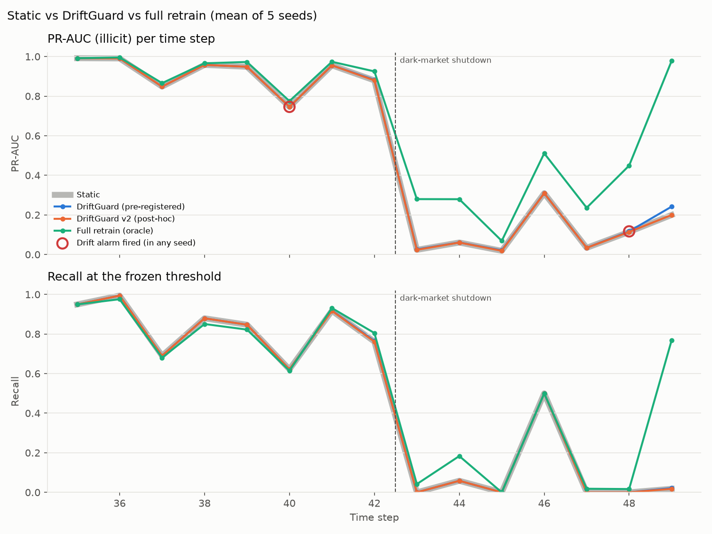
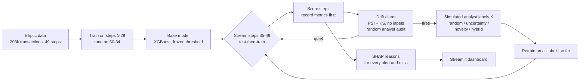
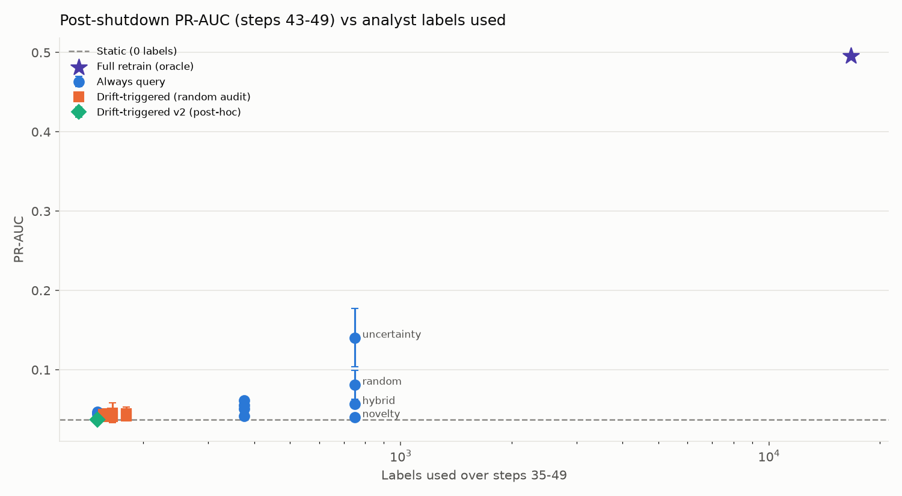
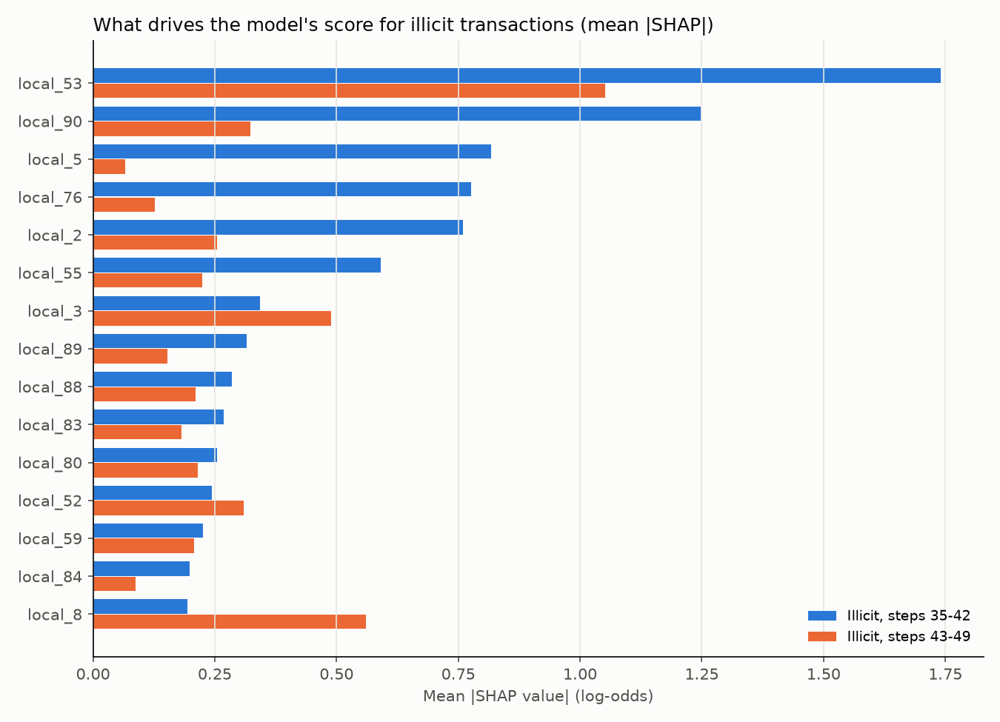
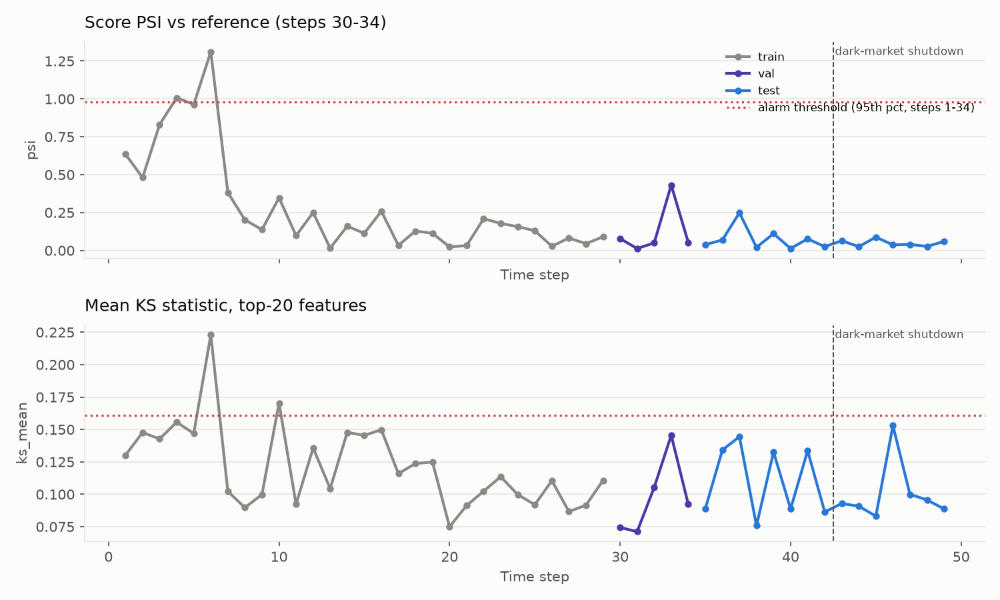
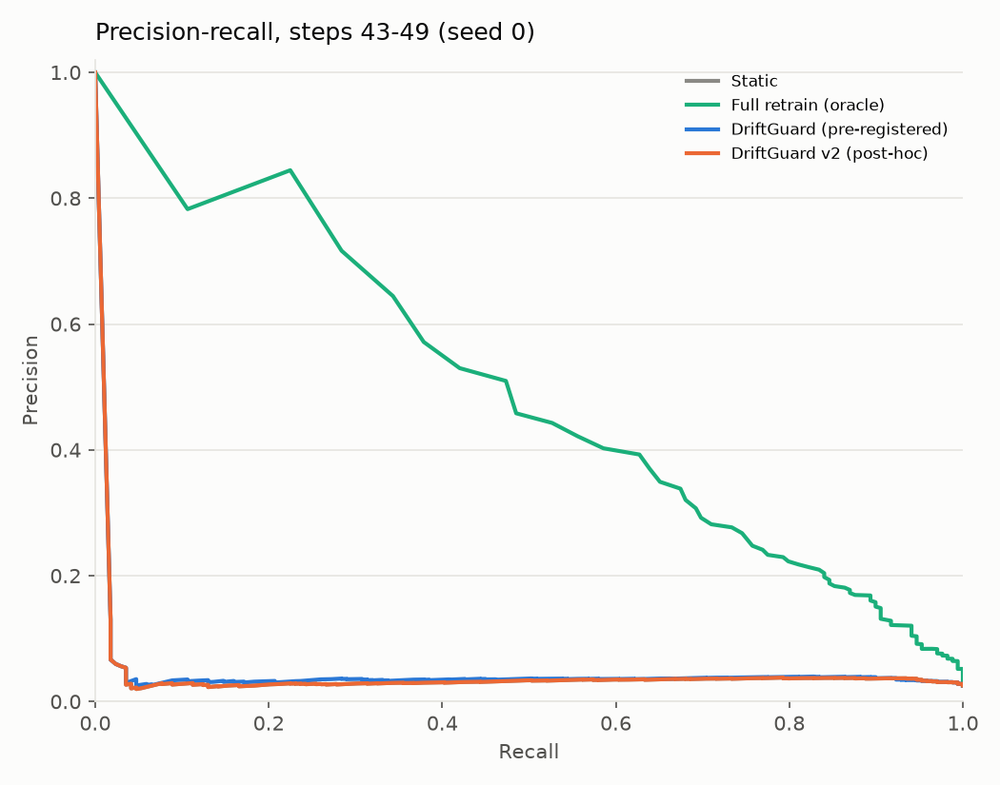
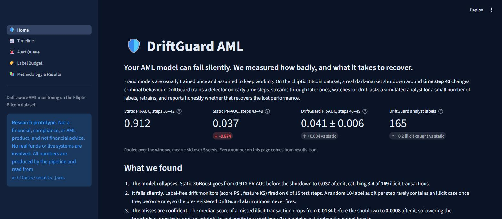
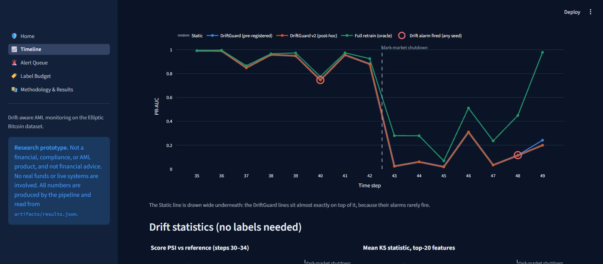
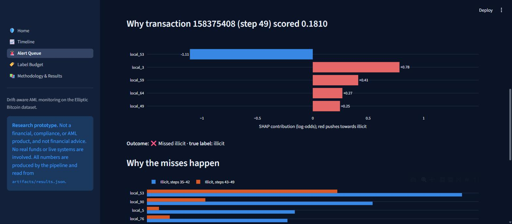
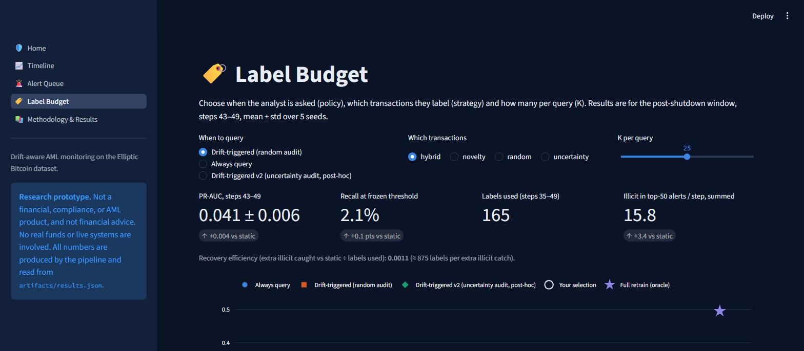

# 🛡️ DriftGuard AML: a blind-spot auditor for AML models

**Your anti-money-laundering model can fail silently. DriftGuard shows *when* a model is confidently wrong, *why*
(SHAP), and *how many analyst reviews* it would take to recover, tested on a real dark-market shutdown in Bitcoin
transaction data.**

🔗 **Live demo:** _TODO: Streamlit Community Cloud URL_ · 🎬 **Video:** _TODO: demo video URL_

Built for the Global Innovation Build Challenge V2, Track 02: Applied (Finance).

> [!IMPORTANT]
> **Disclaimer:** DriftGuard is a **research prototype**. It is **not** a financial, compliance, or AML product, and
> nothing here is financial advice. No real funds, customers, or live systems are involved. All results come from
> a public, anonymised research dataset.



---

## The problem

Banks and exchanges train fraud and AML models once, then assume they keep working. Criminals adapt.
On the [Elliptic Bitcoin dataset](https://www.kaggle.com/datasets/ellipticco/elliptic-data-set), a real
dark-market shutdown around **time step 43** changes criminal behaviour, and a model that looked excellent the
week before stops catching almost anything.

Worse, the model is not *uncertain* about its misses; it is *confident*. The usual safety nets (lowering the
threshold, watching for distribution drift, asking analysts to review borderline cases) are all blind to that kind
of failure. For a compliance team, this means laundering goes through while every dashboard stays green.

## What DriftGuard gives an AML team

| Capability | What it answers | Where |
|---|---|---|
| **Blind-spot audit** | Is the model still catching illicit activity, and are its misses *confident*, which no threshold change can fix? | Timeline, Alert Queue |
| **Explanations** | Why was each alert raised, and why was each illicit case missed? Which old warning signs stopped firing? | Alert Queue (SHAP) |
| **Drift alarm check** | Do standard label-free drift monitors (PSI, KS) and analyst audits actually notice the failure? | Timeline |
| **Label-budget planner** | How many analyst reviews per step, chosen how, buy how much recovery? | Label Budget |

Every claim is tested with a strict no-leakage protocol. The questions behind it:

1. How badly does a well-tuned model break after the shutdown?
2. Can a drift alarm notice, and can a small analyst label budget (K labels per step) bring it back?
3. If not, why not, and what does work?

## Approach



- **Strict time-based splits.** Train on steps 1–29, select the model, decision threshold and drift reference on
  30–34, and touch 35–49 only in the final evaluation and the stream.
- **Static baselines:** trivial prior, class-weighted logistic regression, random forest, XGBoost, plus a feature
  ablation (local → + aggregated → + graph degree).
- **Drift detection** (no labels): score PSI and mean KS statistic over the top-20 features vs steps 30–34,
  thresholds = 95th percentile over steps 1–34 only.
- **Audit alarm** (few labels): each step a simulated analyst labels 10 random transactions; the alarm fires when
  more of them are missed illicit cases than the steps 1–34 calibration allows.
- **Policies:** `static` (never query), `drift_triggered` (DriftGuard), `always` (query every step),
  `full_retrain` (oracle, every label). **Strategies:** random, uncertainty, novelty (IsolationForest), hybrid.
  **K** ∈ {10, 25, 50} × 5 seeds.
- **Metrics:** PR-AUC (primary), F1, precision, recall at the frozen threshold, labels used, recovery efficiency,
  and illicit transactions found in the top-50 alerts per step (a fixed analyst workload).
- **Explainability:** TreeExplainer SHAP for every flagged *and every missed* illicit transaction, using the model
  that actually scored that step.

The headline configuration (drift-triggered, hybrid, K=25), audit size, label weight and alert budget were all
**fixed before the test results were aggregated**. One post-hoc variant (**v2**) was designed after seeing the
phase-4 results, then a label-free **alert-rate** check (**v3**), then literature-inspired **"follow the money"**
graph casework (**v4**). All three are labelled post-hoc, reported separately, and were each run exactly once.
v4 also relaxes one rule: an analyst's paid labels from step t may re-rank *other* transactions of step t
(reviewed transactions are never evaluated). The team approved and disclosed that change.

## Results

All numbers below are generated from [`artifacts/results.json`](artifacts/results.json) by
`python -m driftguard.readme`, and a test fails if they drift apart.

### Headline

<!-- BEGIN:headline -->
Post-shutdown window (steps 43–49), pooled, mean ± std over 5 seeds. For reference, the same static model scores **0.912 ± 0.001** PR-AUC on steps 35–42.

| Configuration | Setting | PR-AUC | Recall | Illicit caught | Analyst labels | Illicit in top-50 alerts/step (sum) |
|---|---|---|---|---|---|---|
| Static | Static (no labels) | 0.037 ± 0.001 | 2.0% | 3.4 of 169 | 0 | 12.4 |
| **DriftGuard (pre-registered)** | Drift-triggered, random audit, hybrid, K=25 | 0.041 ± 0.006 | 2.1% | 3.6 of 169 | 165 | 15.8 |
| DriftGuard v2 (post-hoc) | Drift-triggered v2, uncertainty audit, uncertainty, K=25 | 0.037 ± 0.001 | 2.0% | 3.4 of 169 | 150 | 12.4 |
| Best in grid (selected on test, context only) | Always query, uncertainty, K=50 | 0.140 ± 0.037 | 5.0% | 8.4 of 169 | 750 | 53.6 |
| Full retrain (oracle) | Full retrain (oracle) | 0.495 ± 0.010 | 29.8% | 50.4 of 169 | 16,670 | 111.0 |

Recovery efficiency of the pre-registered DriftGuard (extra illicit caught vs static on 43–49 ÷ labels used): **0.0011**.
<!-- END:headline -->

### Key findings

<!-- BEGIN:findings -->
1. **Standard models collapse after the shutdown.** Static XGBoost falls from 0.912 to 0.037 PR-AUC and catches 3.4 of 169 illicit transactions on steps 43–49.
2. **The failure is silent.** Label-free monitors (score PSI, mean KS over the top-20 features), calibrated on steps 1–34, fired on no test step. The pre-registered random-audit alarm fired on steps 40 and 48 (in any seed), never at step 43, because a 10-transaction audit rarely contains an illicit case once they become rare.
3. **The misses are confident, not uncertain.** The median score of a missed illicit transaction is 0.0134 before the shutdown and 0.0008 after it, so lowering the threshold cannot help. Our post-hoc v2 audits the transactions closest to the threshold; those contain *fewer* illicit cases after the shutdown, so v2 fired on no test step.
4. **The old fingerprints fade.** Mean |SHAP| for illicit transactions, before → after: `local_53` 1.74 → 1.05, `local_90` 1.25 → 0.32, `local_5` 0.82 → 0.07, `local_76` 0.78 → 0.13.
5. **Budget beats triggers.** The pre-registered DriftGuard is within noise of static (0.041 ± 0.006 vs 0.037 ± 0.001, 165 labels). The best adaptive configuration (Always query, uncertainty, K=50) reaches 0.140 ± 0.037 with 750 labels (selected on test results, so context only).
6. **Which transactions to label matters.** Always querying K=50, ranked by post-shutdown PR-AUC: uncertainty (0.140) > random (0.081) > hybrid (0.057) > novelty (0.040). Novelty sampling (IsolationForest) is the weakest. This contradicts our prior that novelty or hybrid would find the new illicit patterns.
7. **Even the alert rate stays normal (post-hoc v3).** The share of *all* transactions the model flags is 7.0% at step 43 (test range 7.0%–19.8%), well above the 2.4% alarm level set by the 5th percentile of steps 1–34, which saw lower rates with no shutdown at all. The alarm fired on no test step, so the planned v3 policy was not run.
8. **Following the money did not help either (post-hoc v4).** After the shutdown an illicit transaction is still far more likely to sit next to another illicit one, so we tested analyst casework that follows payment-graph neighbours of confirmed cases, with the same workload as a score-only control (K reviews + top-50 alerts per step). Illicit transactions identified on steps 43–49: static alerts only 12.4; K=10: control 15.2 vs graph 14.6; K=25: control 21.2 vs graph 19.8; K=50: control 32.0 vs graph 30.0. The model's top-scored reviews confirm too few post-shutdown cases to seed the search, and their neighbours are mostly licit or unlabelled. Graph features that report big post-shutdown gains rely on labels from the same time step, which a real-time monitor does not have.
9. **Recovery is expensive even with every label.** The full-retrain oracle uses 16,670 labels and reaches 0.495 ± 0.010 PR-AUC (29.8% recall).
<!-- END:findings -->

**Bottom line.** We set out to build an alarm that notices the shift and recovers with a few labels. **That part
did not work, and we report it plainly.** What DriftGuard *does* deliver is the diagnosis an AML team needs:
after this shift the model's misses are confident, so label-free monitors, random audits and uncertainty-based
checks all stay quiet. Only label budgets of hundreds of analyst reviews start to help, and full recovery needs
far more. The Label Budget planner makes that trade-off explicit instead of leaving it to guesswork.

| | |
|---|---|
|  |  |
|  |  |

### Static baselines and feature ablation

<!-- BEGIN:baselines -->
| Model | Features | Validation PR-AUC | PR-AUC 35–42 | PR-AUC 43–49 | Recall 43–49 |
|---|---|---|---|---|---|
| Trivial (prior) | `local_agg_graph` | 0.168 ± 0.000 | 0.092 ± 0.000 | 0.025 ± 0.000 | 100.0% |
| Logistic Regression | `local_agg_graph` | 0.582 ± 0.000 | 0.332 ± 0.000 | 0.044 ± 0.000 | 44.4% |
| Random Forest | `local_agg_graph` | 0.939 ± 0.014 | 0.900 ± 0.001 | 0.029 ± 0.002 | 4.5% |
| XGBoost | `local_agg_graph` | 0.977 ± 0.005 | 0.915 ± 0.001 | 0.037 ± 0.003 | 4.7% |
| XGBoost | `local` | 0.986 ± 0.001 | 0.897 ± 0.002 | 0.032 ± 0.001 | 2.2% |
| XGBoost | `local_agg` | 0.977 ± 0.005 | 0.914 ± 0.001 | 0.036 ± 0.002 | 4.3% |

Protocol: train steps 1-29, threshold + model selection on 30-34, frozen evaluation on 35-49. Base model for the stream: **XGBoost on `local` features** (best validation PR-AUC, 0.986).
<!-- END:baselines -->

## Dashboard

| Home | Timeline |
|---|---|
|  |  |
| **Alert Queue: a missed illicit transaction explained** | **Label Budget** |
|  |  |

The app reads **only** the committed files in `artifacts/`. It needs no data download and runs on Streamlit
Community Cloud.

## Setup

**Prerequisites:** Python 3.11, and a [Kaggle API token](https://www.kaggle.com/docs/api) at
`~/.kaggle/kaggle.json` (needed only to rebuild results, not to run the dashboard). Accept the dataset's terms on
its Kaggle page first.

```bash
git clone https://github.com/ajafarsadiq2002/driftguard-aml.git
cd driftguard-aml
python3.11 -m venv .venv                 # or: uv venv --python 3.11 .venv
# Windows: .venv\Scripts\activate   |   macOS/Linux: source .venv/bin/activate
pip install -r requirements.txt
pip install -e .
```

**Run the dashboard** (works immediately from committed artifacts):

```bash
streamlit run app/app.py
```

## Reproducing the results

```bash
# 1. Get the data (CC BY-NC-ND 4.0: it is not redistributed in this repo)
kaggle datasets download -d ellipticco/elliptic-data-set -p data/raw --unzip

# 2. Rebuild every artifact (data -> static baselines -> drift + stream grid -> results, figures, SHAP, README)
python -m driftguard.pipeline --all

# Or stage by stage
python -m driftguard.pipeline --data     # load, validate (fails loudly on wrong counts), save Parquet
python -m driftguard.pipeline --train    # static baselines + feature ablation, 5 seeds
python -m driftguard.pipeline --stream   # drift calibration + full policy x strategy x K x seed grid
python -m driftguard.pipeline --eval     # SHAP alerts, results.json, figures, README numbers

# Checks
python -m pytest
python -m ruff check .
```

The loader also finds the CSVs if they sit in an `elliptic_bitcoin_dataset/` folder at the repo root. A `Makefile`
offers the same stages (`make all`, `make test`, `make app`) as thin wrappers around these commands.

<!-- BEGIN:runtime -->
Last full run on a 16-thread laptop CPU (Windows, Python 3.11.5): `--data` 3 s, `--train` 1.0 min, `--stream` 7.9 min, `--eval` 14 s; total ≈ 9 min. Seeds: [0, 1, 2, 3, 4].
<!-- END:runtime -->

### How we kept it honest

- `tests/test_splits.py`: training and tuning never see a test step.
- `tests/test_active.py`: in the stream, **every prediction for step t comes from a model trained only on steps < t**,
  for every policy; the analyst can only label ground-truth rows of the current step.
- `tests/test_drift.py`: drift and audit thresholds refuse calibration data from step 35 onwards.
- `tests/test_explain.py`: alerts never contain raw feature values.
- `tests/test_casework.py`: v4 uses the same analyst workload as its control and never evaluates reviewed rows.
- `tests/test_readme.py`: README numbers match `results.json`.
- Fixed seeds; five seeds for everything stochastic; mean ± std everywhere.

## Repository structure

```
driftguard-aml/
├── src/driftguard/
│   ├── config.py      # splits, seeds, K values, thresholds, headline config: single source of truth
│   ├── data.py        # load, validate, merge, graph degree features
│   ├── splits.py      # time-based splits + leakage assertions
│   ├── models.py      # LR / RF / XGBoost builders, F1-optimal threshold
│   ├── drift.py       # PSI, KS, audit alarm, leakage-safe calibration
│   ├── active.py      # query strategies + simulated analyst
│   ├── stream.py      # prequential test-then-train loop + parallel grid
│   ├── evaluate.py    # metrics, aggregation, results.json, figures
│   ├── explain.py     # SHAP for alerts and misses
│   ├── casework.py    # post-hoc v4 "follow the money" graph casework
│   ├── readme.py      # regenerates README numbers from results.json
│   └── pipeline.py    # CLI: python -m driftguard.pipeline --all
├── app/               # Streamlit dashboard (reads artifacts/ only)
├── artifacts/         # committed results: results.json, parquet tables, figures
├── tests/             # leakage, drift, metrics, active learning, explain, README tests
├── docs/              # AI disclosure, screenshots
├── Makefile           # optional thin wrapper
└── requirements.txt   # pinned, CPU only
```

## Dataset and citation

Weber, M., Domeniconi, G., Chen, J., Weidele, D. K. I., Bellei, C., Robinson, T., & Leiserson, C. E. (2019).
*Anti-Money Laundering in Bitcoin: Experimenting with Graph Convolutional Networks for Financial Forensics.*
KDD Workshop on Anomaly Detection in Finance. Data: **Elliptic Data Set**, licensed **CC BY-NC-ND 4.0**.

The raw data is **not** redistributed in this repository (`data/` is git-ignored). `artifacts/` contains only
derived metrics, transaction IDs with model scores and SHAP contributions, and figures. It contains no raw feature
values.

## Limitations

- **Single dataset, single shift.** One dark-market shutdown on one anonymised dataset; results may not
  generalise to other markets, institutions or shift types.
- **Anonymised features.** SHAP names features such as `local_53` but they cannot be read as business rules.
- **Simulated analyst.** Real labels arrive late, cost money and are sometimes wrong; ours are instant and perfect.
- **Few labels, rare positives.** Only about 23% of transactions are labelled, and after the shutdown some steps have
  only a handful of illicit cases. Per-step metrics are noisy, so we report pooled windows.
- **Fixed design choices.** Post-deployment labels get a fixed sample weight of 10; the audit size is 10; the
  alert budget is 50. These were set before the results and not tuned.
- **Post-hoc v2, v3 and v4.** The uncertainty audit, the alert-rate check and the graph casework were designed after
  seeing test results. Each was run once and is reported separately. v4 uses a relaxed, disclosed protocol.
- **Drift rule change.** The originally specified KS rule (share of features with p < 0.01) saturates at this sample
  size; we replaced it with the mean KS statistic based on steps 1–34 alone, and report both.

## Built with

Python 3.11 · pandas · NumPy · scikit-learn · XGBoost · SciPy · SHAP · Matplotlib · Plotly · Streamlit · joblib ·
PyArrow · pytest · ruff · Kaggle API · Streamlit Community Cloud

## AI disclosure

Most of the code, tests and documentation in this repository were written by **Claude Code** (Anthropic's AI coding
agent), directed and reviewed by the team, who made every commit. Details in
[`docs/AI_DISCLOSURE.md`](docs/AI_DISCLOSURE.md).

## Team

_TODO: team members' full names_

## License

Code: [MIT](LICENSE). Data: Elliptic Data Set, CC BY-NC-ND 4.0 (not included).
